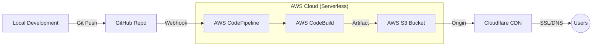

# Seamless React Deployment: AWS S3 + CodePipeline + Cloudflare (Step-by-Step Guide)

In modern web development, managing servers is becoming a relic of the past. If you're building a React or Vite project, traditional VPS hosting is often overkill. Enter **Serverless Static Hosting**—a faster, cheaper, and more secure way to deploy your applications.

In this guide, I will walk you through the exact process we use at **Dijital Mecra** to deploy high-performance landing pages using **AWS S3**, **AWS CodePipeline**, and **Cloudflare**.

---

## 💡 Why Choose AWS S3 & Serverless Hosting?

Before we dive into the "How," let's talk about the "Why":
- **Zero Server Management**: No OS updates, no security patches, no SSH keys. AWS handles the infrastructure.
- **Extreme Cost Efficiency**: You only pay for what you use. For most small to medium sites, it's virtually free.
- **Global Scalability**: S3 integrates seamlessly with CDNs like Cloudflare, ensuring your site loads in milliseconds globally.
- **Top-Tier Security**: Without a server to "hack," your attack surface is drastically reduced.

---

## 🏗️ The Architecture: How It Works

Here is the high-level flow from your keyboard to the user's browser:

1. **Source**: Code is pushed to GitHub, triggering a webhook for AWS CodePipeline.
2. **Build**: AWS CodeBuild runs `npm run build`, generating the `dist` folder.
3. **Deploy**: Files are automatically synced to your S3 Bucket.
4. **CDN**: Cloudflare caches the S3 content globally and provides SSL/DNS.

---

## 🛠️ Step-by-Step Setup (12 Steps)

### Step 1: Create Your S3 Bucket
Head over to the AWS S3 console and create a bucket (e.g., `s3-digital-mecra`). Choose your preferred region (e.g., `us-east-1`).

### Step 2: Initialize CodePipeline
Create a new pipeline. Select `digital-mecra` as the name and set the execution mode to `Queued`. Allow AWS to create a new service role.

### Step 3: Connect to GitHub
Select `GitHub (via OAuth app)` as the source provider. Authorize your account to allow AWS to listen for changes in your repository.

### Step 4: Repository and Branch Selection
Select your repository (`hakanbayraktar/s3-landing-page`) and the `main` branch to ensure every push triggers a deployment.

### Step 5: Configure CodeBuild Environment
Choose `Amazon Linux 2` as the OS and `aws/codebuild/amazonlinux2-x86_64-standard:5.0` as the image. This environment will run your build scripts.

### Step 6: Buildspec and Logging
Use the `buildspec.yml` file located in your project root. Enable `CloudWatch logs` for better debugging during the build process.

### Step 7: Finalize Build Stage
Confirm your CodeBuild project and proceed to the deployment phase.

### Step 8: Deploy to S3 (Crucial Step)
**IMPORTANT**: When configuring the S3 deployment, make sure to check the **"Extract file before deploy"** box. If missed, S3 will store your build as a single `.zip` file instead of serving individual HTML/JS files.

### Step 9: Monitor Your First Deployment
Once the pipeline starts, monitor all three stages (Source, Build, Deploy). Wait for the satisfying green **"Succeeded"** status.

### Step 10: Enable Static Website Hosting
Go to your S3 bucket's **Properties** tab. Scroll down to enable **Static website hosting** and specify `index.html` as the index document.

### Step 11: Permissions and Public Access
Disable "Block all public access" and apply a **Bucket Policy** to allow global read access. Use the JSON template below, making sure to replace the bucket ARN with your own.

### Step 12: DNS Configuration with Cloudflare
On Cloudflare, add a `CNAME` record pointing your domain to the S3 Website Endpoint. Ensure the **Proxy status** is set to "Proxied" (Orange cloud) for SSL protection.

---

## Conclusion

Deploying a React site doesn't have to be complex or expensive. By utilizing the power of **AWS S3** and **Cloudflare**, you gain enterprise-grade performance and security with minimal effort.

**Happy Deploying!** 🚀

*This guide was brought to you by **Dijital Mecra**—Your partner in modern Web & DevOps solutions.*
