# 🚀 Dijital Mecra | Profesyonel AWS S3 & Cloudflare Dağıtım Rehberi

[](https://aws.amazon.com/)
[](https://www.cloudflare.com/)
[](https://en.wikipedia.org/wiki/DevOps)

Modern web uygulamalarınızı **AWS S3** üzerinde barındırıp, **AWS CodePipeline** ve **Cloudflare** ile profesyonel bir yayına alma sürecini bu kapsamlı rehberde bulabilirsiniz.

---

## 🏗️ 1. Adım: AWS S3 Bucket Hazırlığı

Sitemizin temelini oluşturacak S3 bucket'ını yapılandırıyoruz.

1.  **S3 Bucket Oluşturma**: `s3-digital-mecra` adında bir bucket oluşturun. Bölge (Region) olarak `us-east-1` (N. Virginia) önerilir.
2.  **Statik Hosting**: Bucket ayarlarına gidin ve **Static website hosting**'i aktif edin.
3.  **İzinler (Permissions)**: "Block all public access" seçeneğini kaldırın.

| Adım 1.1: Bucket İsmi | Adım 1.2: Statik Hosting |
| :--- | :--- |
| 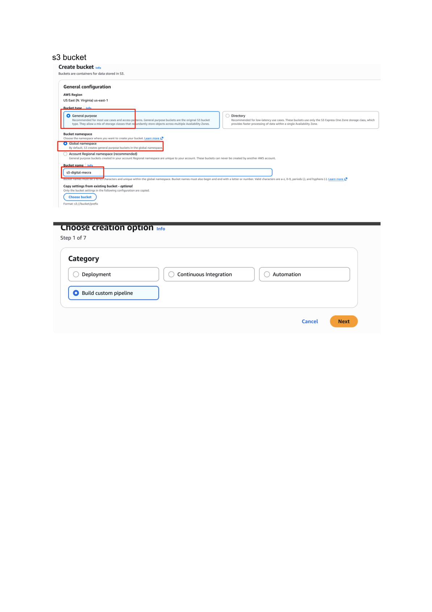 | 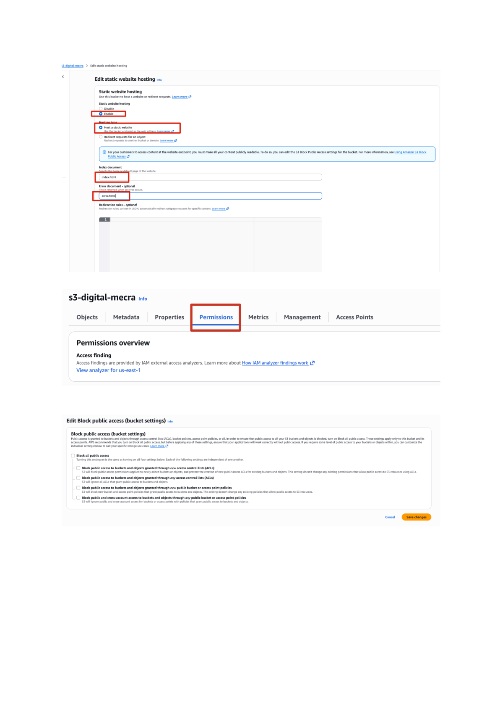 |

---

## 🔄 2. Adım: AWS CodePipeline CI/CD Kurulumu

Kodunuz her değiştiğinde (GitHub'a her push yaptığınızda) sitenizin otomatik olarak derlenip güncellenmesi için bir boru hattı kuruyoruz.

### 2.1. Pipeline Ayarları
1.  **İsim**: `digital-mecra`
2.  **Mod**: `Queued` (Kuyruğa alınmış)
3.  **Hizmet Rolü (Service Role)**: Yeni bir rol oluşturulmasına izin verin.

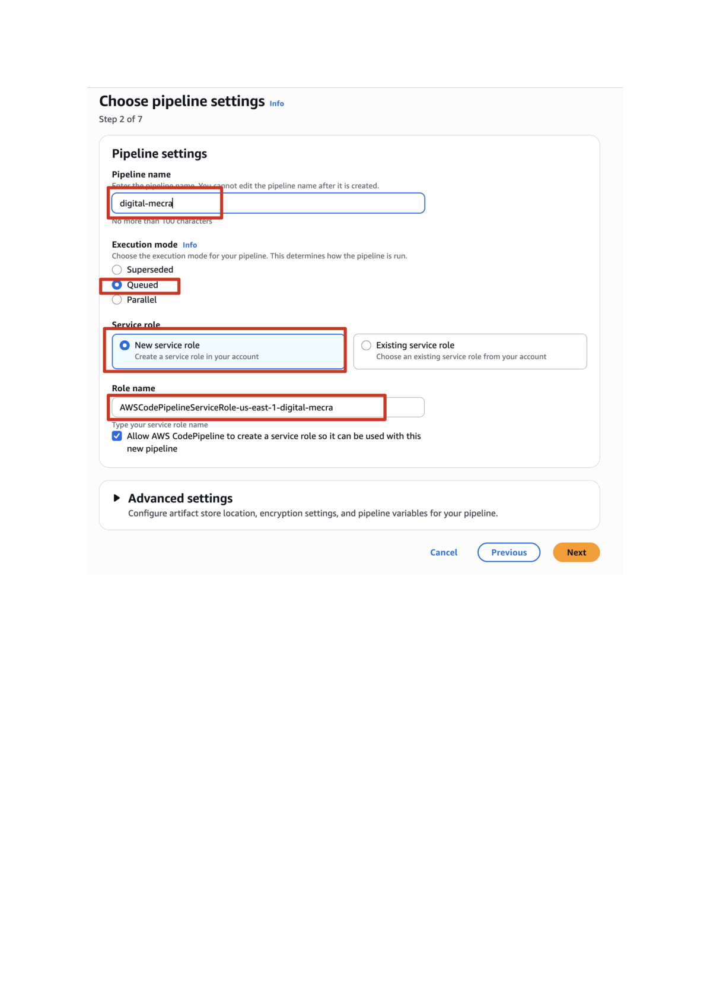

### 2.2. Kaynak (Source) Aşaması
- **Kaynak Sağlayıcı**: `GitHub (via OAuth app)` seçin.
- **Depo**: `hakanbayraktar/s3-landing-page` (veya kendi deponuz).
- **Dal (Branch)**: `main`

| Kaynak Bağlantısı | Depo Seçimi |
| :--- | :--- |
| 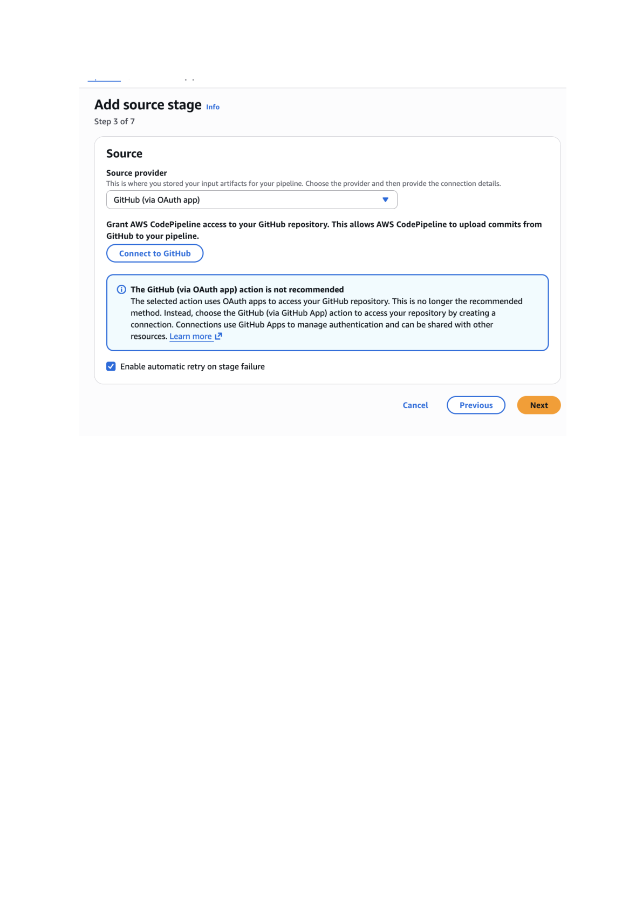 | 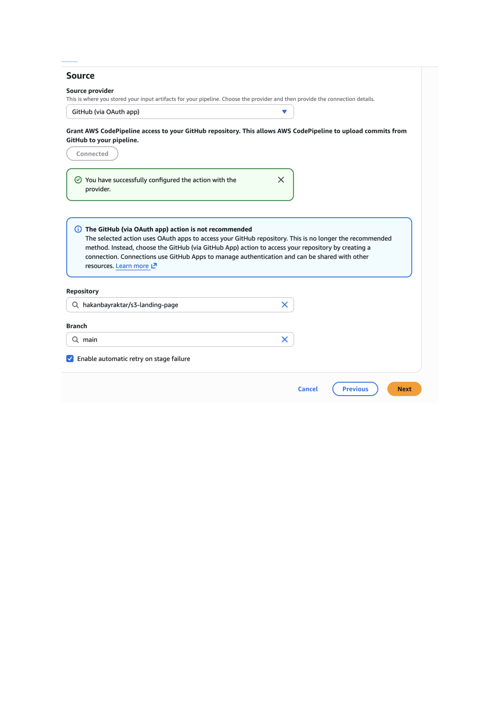 |

---

## 🏗️ 3. Adım: AWS CodeBuild Kurulumu

Projemizin derlenmesi (Build) için gerekli olan yapılandırma.

1.  **Proje Adı**: `digital-mecra`
2.  **Ortam (Environment)**: `Amazon Linux 2`, `Standard`, Image: `aws/codebuild/amazonlinux2-x86_64-standard:5.0`.
3.  **Buildspec**: Dosyamızdaki `buildspec.yml` talimatlarını kullanın.

| Build Ortamı | Buildspec & Loglar | Build Aşaması İncelemesi |
| :--- | :--- | :--- |
| 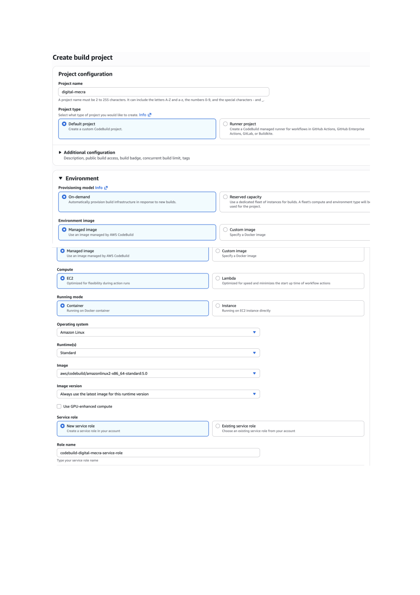 | 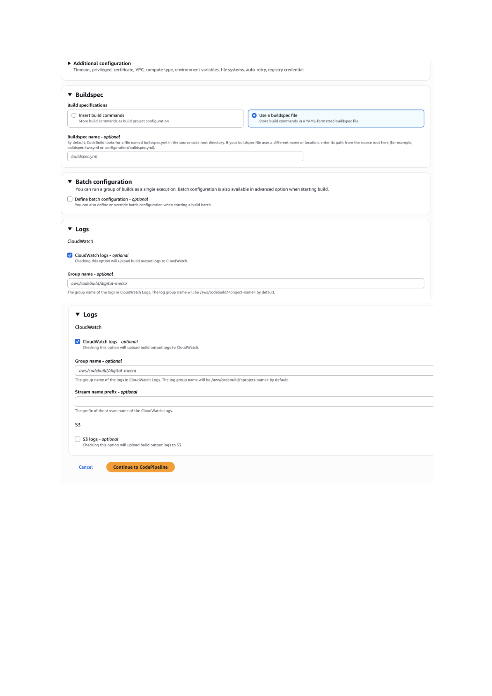 | 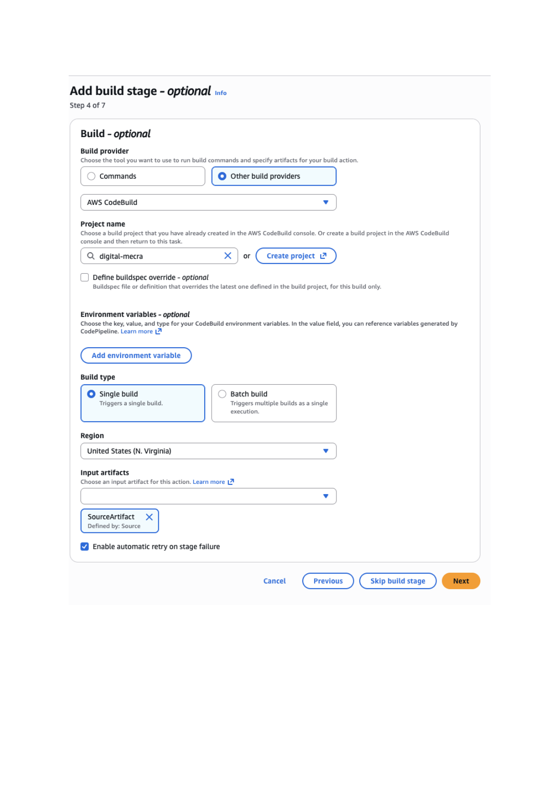 |

---

## 📦 4. Adım: Dağıtım (Deploy) Aşaması

Build edilen dosyaların S3 bucket'ına aktarılması.

> [!CAUTION]
> **Kritik Ayar**: Dağıtım sırasında **"Extract file before deploy"** (Dağıtımdan önce dosyayı çıkar) seçeneğini mutlaka işaretleyin. Aksi takdirde siteniz `.zip` olarak kalacak ve açılmayacaktır.

- **Dağıtım Sağlayıcı**: `Amazon S3`
- **Hedef Bucket**: `s3-digital-mecra`

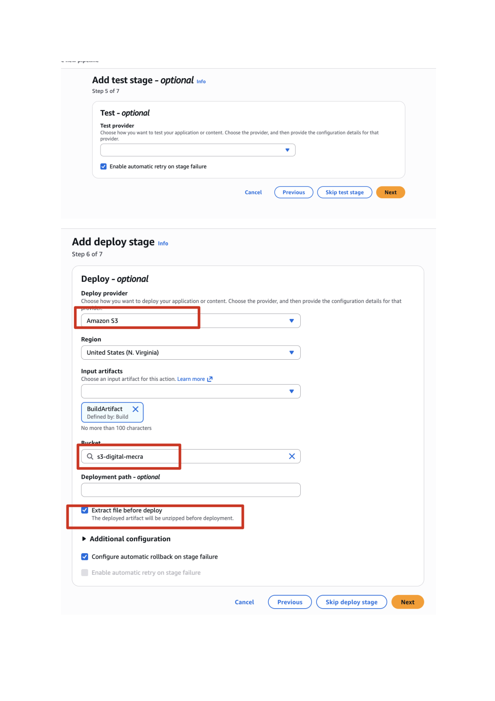

---

## 🌐 5. Adım: Cloudflare CNAME & SSL

Sitenizi kendi domain adınız üzerinden global olarak yayına açın.

1.  **Cloudflare DNS**: Panelden bir `CNAME` kaydı ekleyin.
2.  **Hedef (Target)**: S3 bucket endpoint'inizi girin (Örn: `s3-digital-mecra.s3-website-us-east-1.amazonaws.com`).
3.  **Proxy Status**: Turuncu bulut (Proxied) durumunda olduğundan emin olun (SSL desteği için).

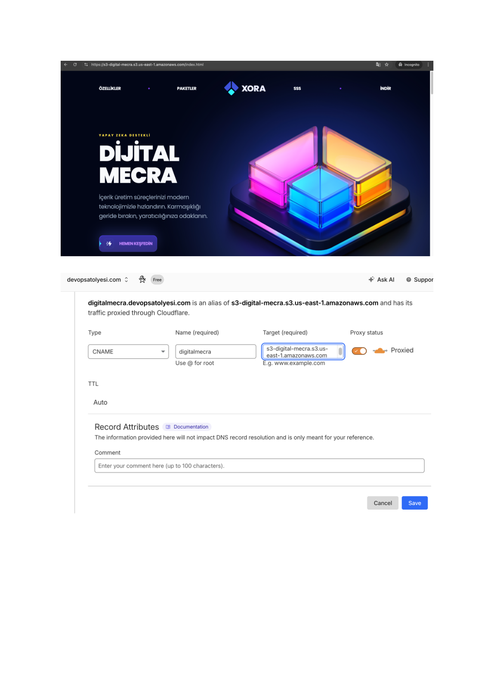

---

## 🚨 Kritik Güvenlik & CORS Yapılandırmaları

Sitenizin hatasız çalışması için şu iki ayarı yapmalısınız:

### 1️⃣ CORS Ayarı (Access-Control-Allow-Origin)
S3 Bucket -> Permissions -> CORS kısmına ekleyin:
```json
[
    {
        "AllowedHeaders": ["*"],
        "AllowedMethods": ["GET", "HEAD"],
        "AllowedOrigins": ["*"],
        "ExposedHeaders": []
    }
]
```

### 2️⃣ Bucket Policy (Genel Erişim)
S3 Bucket -> Permissions -> Bucket Policy kısmına ekleyin:
```json
{
    "Version": "2012-10-17",
    "Statement": [
        {
            "Sid": "PublicReadGetObject",
            "Effect": "Allow",
            "Principal": "*",
            "Action": "s3:GetObject",
            "Resource": "arn:aws:s3:::s3-digital-mecra/*"
        }
    ]
}
```

| Başarılı Dağıtım | Bucket Nesneleri | Bucket Politikası |
| :--- | :--- | :--- |
| 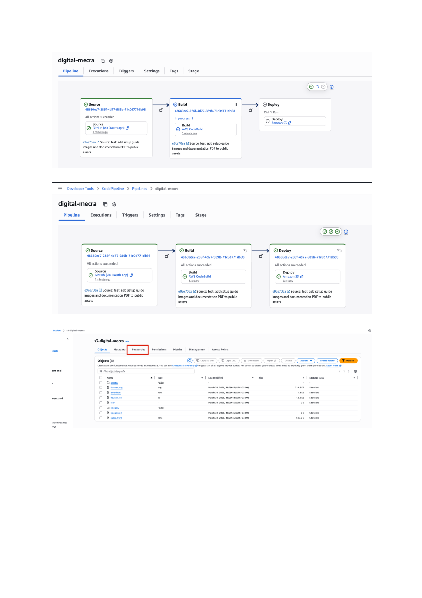 | 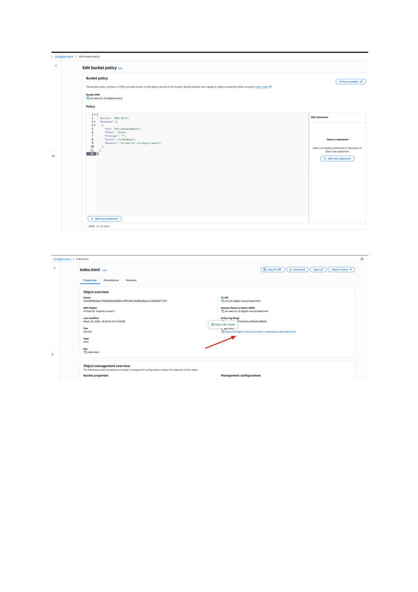 |  |

---

## 💻 Yerel Geliştirme

```bash
# Bağımlılıkları yükleyin
npm install --legacy-peer-deps

# Geliştirme sunucusunu başlatın (Vite)
npm run dev

# Production build test edin
npm run build
```

---
**Dijital Mecra** - Modern Web ve DevOps Çözümleri 🌟