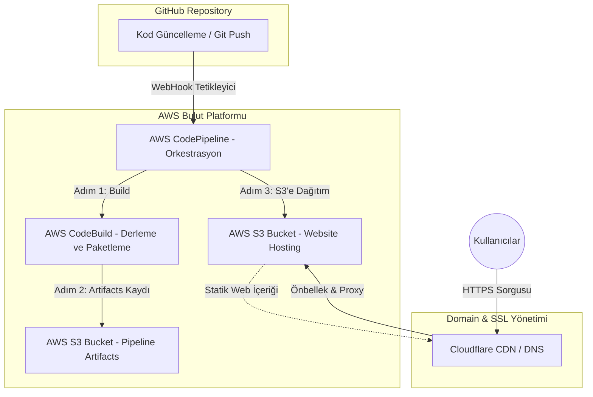
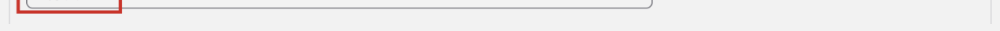
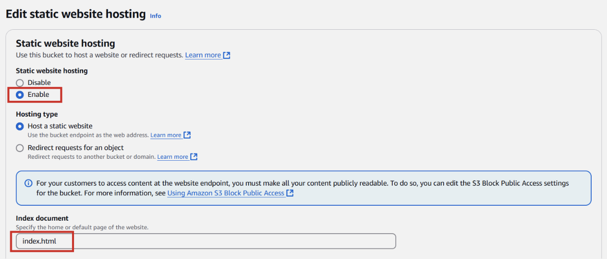
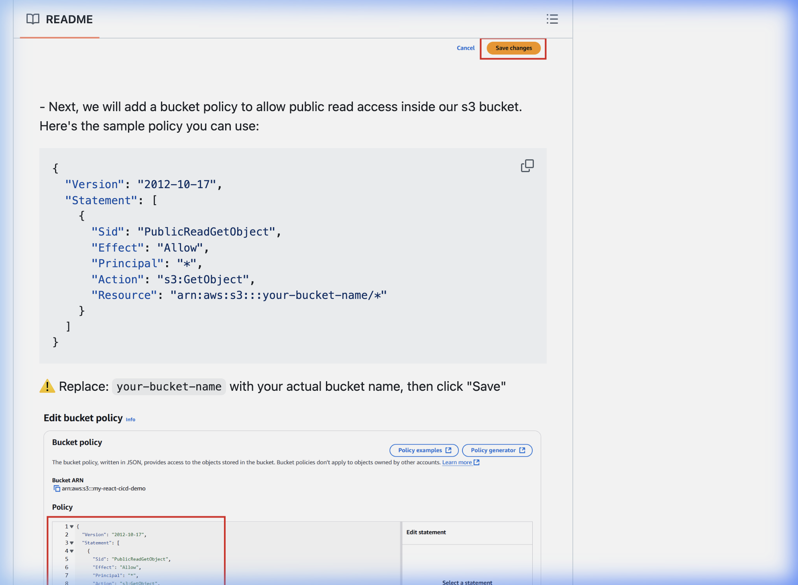
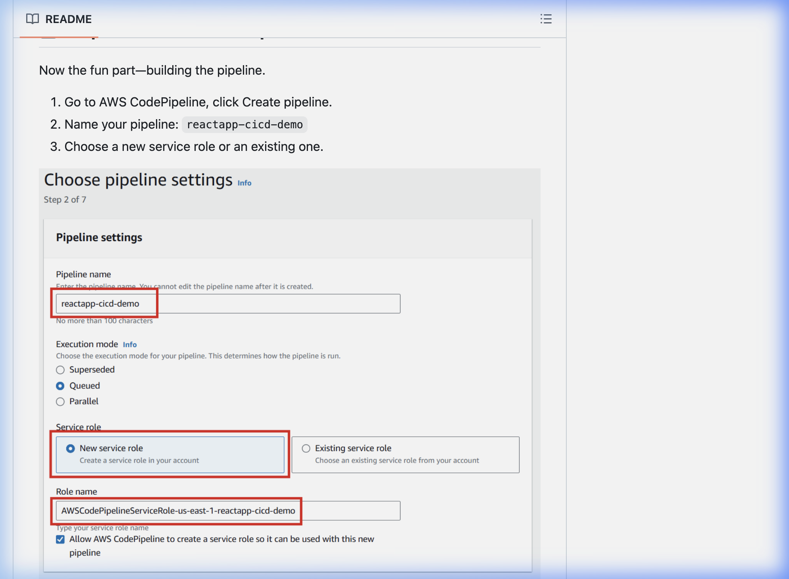
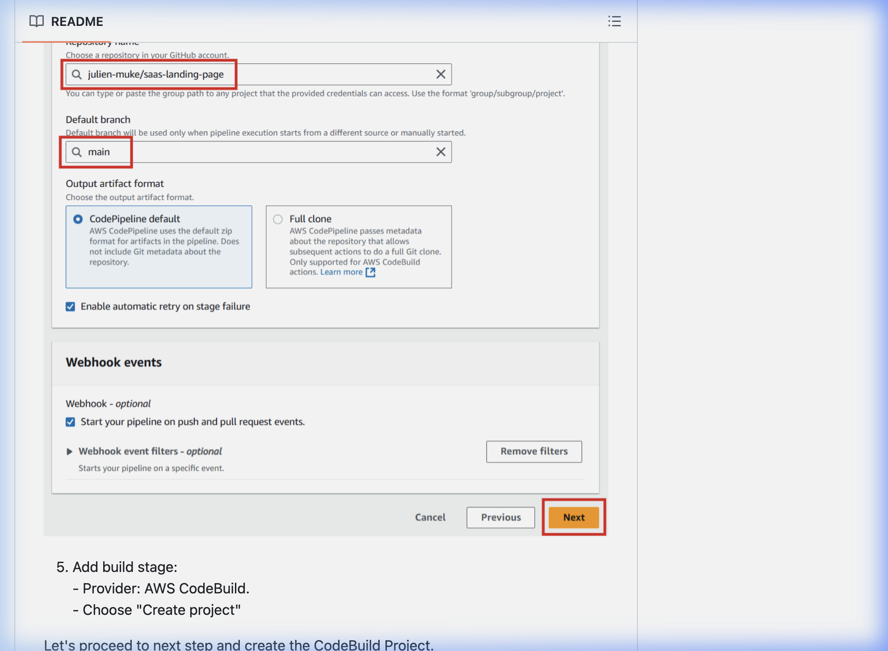
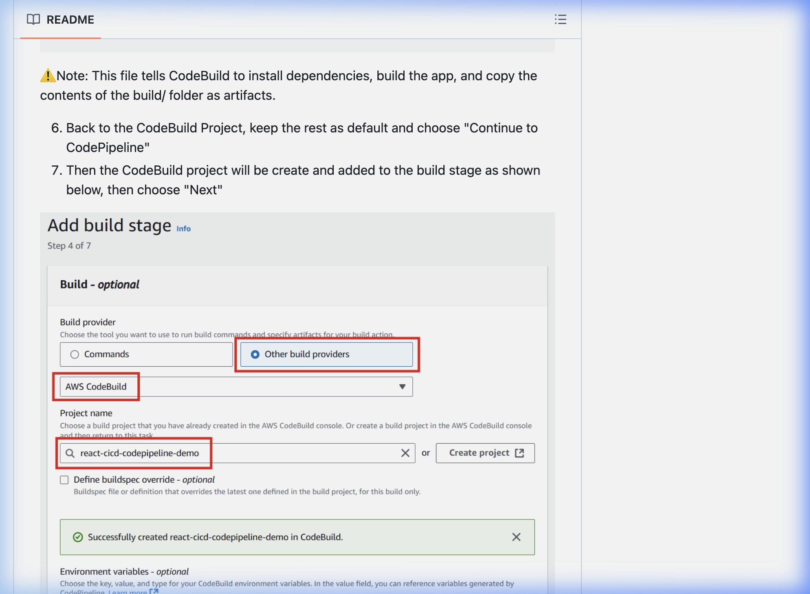
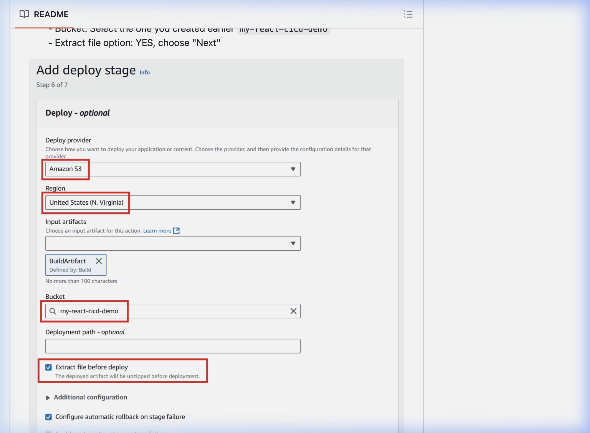
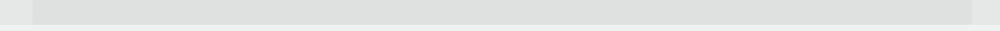

# Dijital Mecra | AWS S3 Hosting & Tam Otomatik CI/CD İş Akışı Rehberi 🚀


Bu proje, bir React uygulamasının **AWS S3** üzerinde statik olarak barındırılmasını ve **AWS CodePipeline** araçları ile uçtan uca otomatik bir **CI/CD (Sürekli Entegrasyon / Sürekli Dağıtım)** hattının nasıl kurulacağını profesyonel düzeyde anlatmaktadır.

Bu rehber, [julien-muke/aws-codepipeline-react-s3](https://github.com/julien-muke/aws-codepipeline-react-s3) eğitim serisi temel alınarak **Dijital Mecra** altyapısına uygun şekilde hazırlanmıştır.

---

## 🏗️ Proje Mimarisi

Daha önce çizmiş olduğumuz bu mimari şema, kodun GitHub'dan başlayıp global CDN ağına (Cloudflare) ulaşana kadar takip ettiği yolu göstermektedir:



---

## 🛠️ Detaylı AWS Kurulum ve Yapılandırma Adımları

Aşağıdaki adımlar, projenizi AWS bulutunda profesyonelce barındırmak için izlemeniz gereken tam prosedürdür.

### 📋 Ön Hazırlık
1. **AWS Hesabı:** Aktif bir AWS hesabınızın olduğundan emin olun.
2. **GitHub Deposu:** Bu repoyu kendi GitHub hesabınıza kopyalayın (Fork) veya yeni bir repo oluşturun.
3. **Buildspec Dosyası:** Proje kökündeki `buildspec.yml` dosyasının varlığından emin olun.

---

### Adım 1: Amazon S3 Bucket Kurulumu (Statik Hosting)
1. **Amazon S3** konsoluna gidin ve **"Create bucket"** butonuna tıklayın.
2. **Bucket Name:** `digitalmecra-s3-bucket` (Özgün bir isim olmalı).
3. **Permissions:** "Block all public access" seçimini kaldırın.
   
4. **Properties Sekmesi:** En altta **Static website hosting** seçeneğini etkinleştirin.
   
5. **Bucket Policy:** Permissions sekmesine giderek genel okuma izni veren politikayı ekleyin.
   

---

### Adım 2: AWS CodePipeline CI/CD Hattının Oluşturulması
1. **Step 1: Choose pipeline settings**
   - **Pipeline name:** `digitalmecra-pipeline`
   - **Service role:** "New service role" seçeneğini işaretleyin.
   

2. **Step 2: Add source stage**
   - **Source provider:** GitHub (Version 2).
   

3. **Step 3: Add build stage**
   - **Build provider:** AWS CodeBuild.
   

4. **Step 4: Add deploy stage**
   - **Deploy provider:** Amazon S3.
   - **Bucket:** `digitalmecra-s3-bucket`.
   - **ÖNEMLİ:** "Extract file before deploy" kutucuğunu işaretleyin.
   

---

### Adım 5: Dağıtımı Doğrulama
Pipeline başarılı bir şekilde tamamlandığında, S3 statik web sitesi adresinizden projenize erişebilirsiniz.


---

### Adım 6: Cloudflare ile Custom Domain & SSL Ayarları
Sitenizin kurumsal bir domain (`digitalmecra.devopsatolyesi.com`) altında HTTPS ile yayınlanması için Cloudflare DNS ayarlarını yapın.

---

## 🚀 Yerel Geliştirme Notları

```bash
# Bağımlılıkları yükleyin
npm install --legacy-peer-deps

# Geliştirme sunucusunu başlatın
npm run dev
```

**Dijital Mecra** - AWS & DevOps Eğitim Platformu