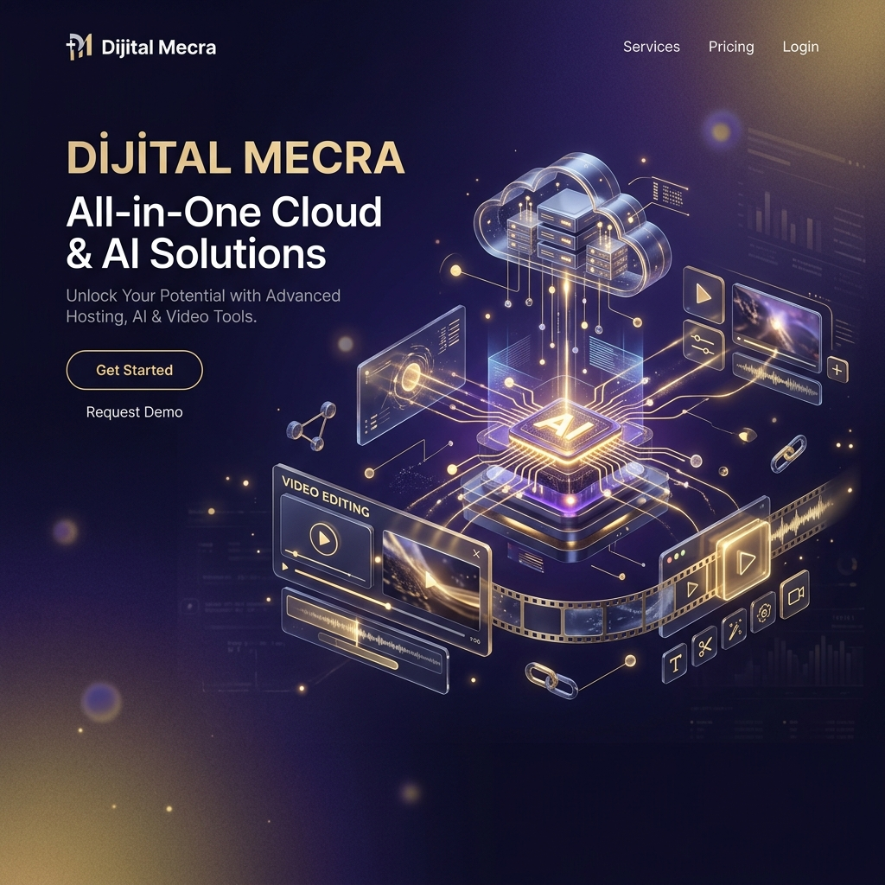
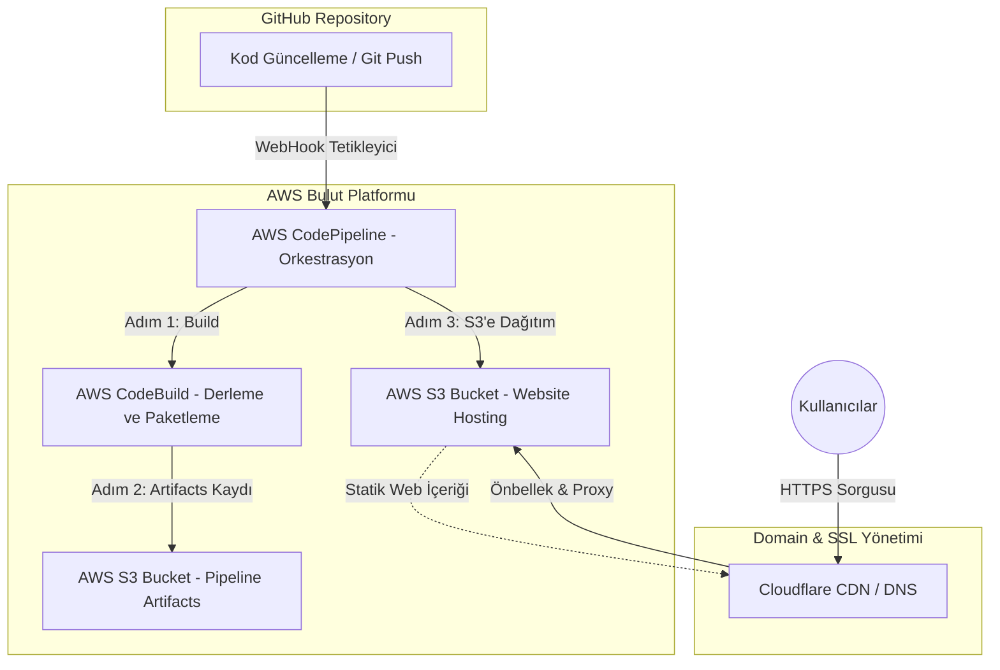
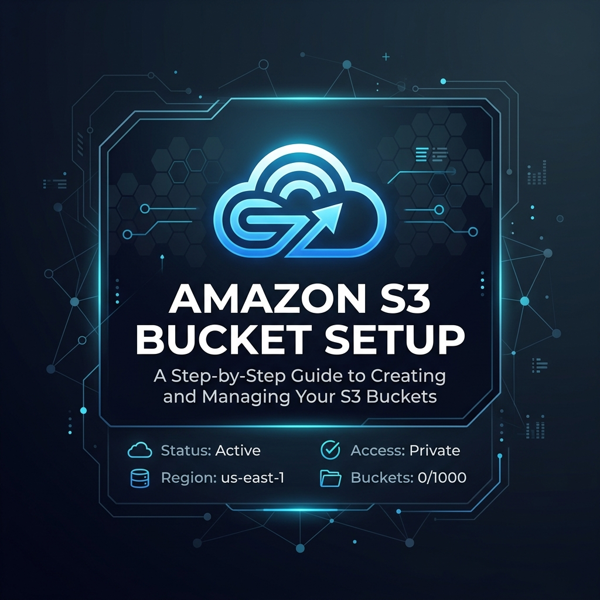
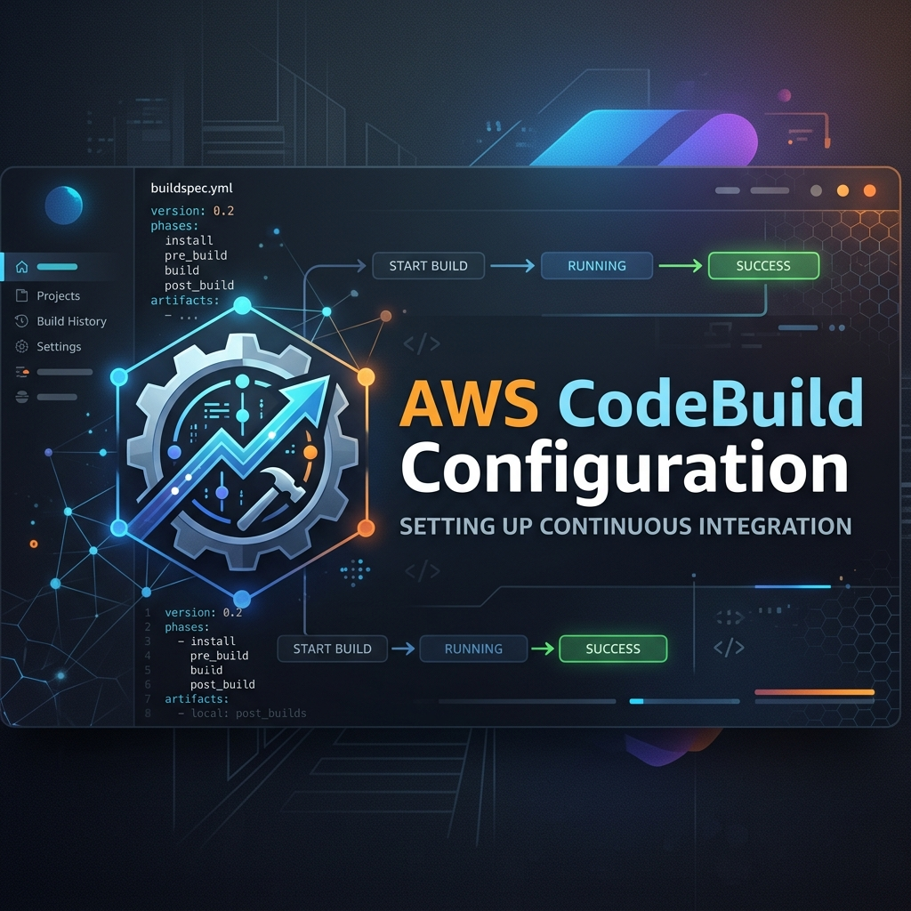
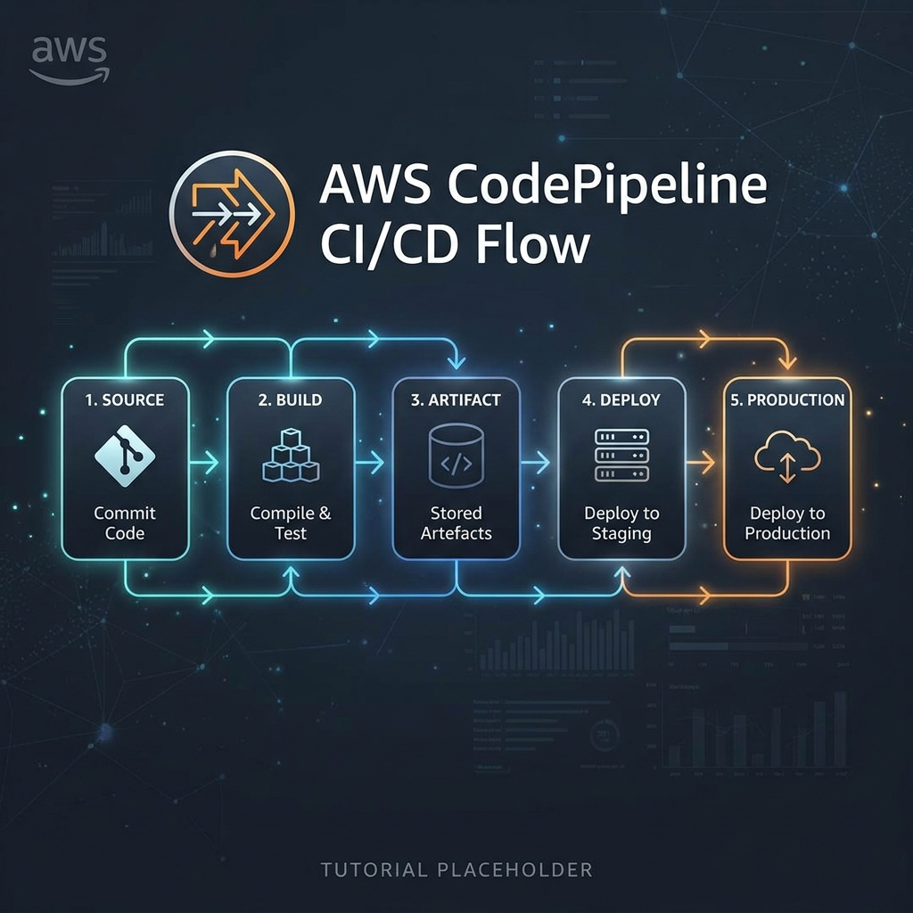
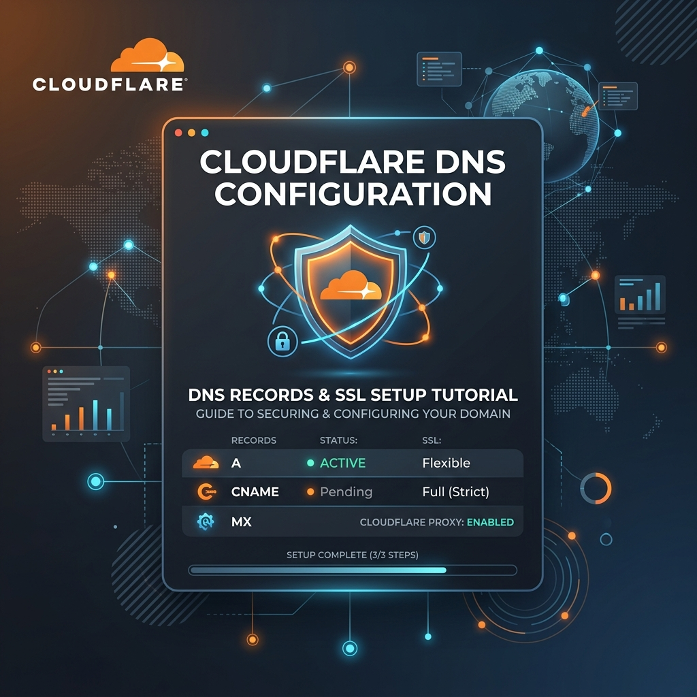

# Dijital Mecra | AWS S3 Hosting & Tam Otomatik CI/CD İş Akışı Rehberi 🚀



Bu proje, bir React uygulamasının **AWS S3** üzerinde statik olarak barındırılmasını ve **AWS CodePipeline** araçları ile uçtan uca otomatik bir **CI/CD (Sürekli Entegrasyon / Sürekli Dağıtım)** hattının nasıl kurulacağını profesyonel düzeyde anlatmaktadır.

Bu rehber, [julien-muke/aws-codepipeline-react-s3](https://github.com/julien-muke/aws-codepipeline-react-s3) eğitim serisi temel alınarak **Dijital Mecra** altyapısına uygun şekilde hazırlanmıştır.

---

## 🏗️ Proje Mimarisi

Daha önce çizmiş olduğumuz bu mimari şema, kodun GitHub'dan başlayıp global CDN ağına (Cloudflare) ulaşana kadar takip ettiği yolu göstermektedir:



---

## 🛠️ Detaylı AWS Kurulum ve Yapılandırma Adımları

Aşağıdaki adımlar, projenizi AWS bulutunda profesyonelce barındırmak için izlemeniz gereken tam prosedürdür.

### 📋 Ön Hazırlık
1. **AWS Hesabı:** Aktif bir AWS hesabınızın olduğundan emin olun.
2. **GitHub Deposu:** Bu repoyu kendi GitHub hesabınıza kopyalayın (Fork) veya yeni bir repo oluşturun.
3. **Buildspec Dosyası:** Proje kökündeki `buildspec.yml` dosyasının varlığından emin olun.

---

### Adım 1: Amazon S3 Bucket Kurulumu (Statik Hosting)
1. **Amazon S3** konsoluna gidin ve **"Create bucket"** butonuna tıklayın.
2. **Bucket Name:** `digitalmecra-s3-bucket` (Özgün bir isim olmalı).
3. **Object Ownership:** ACLs disabled (recommended).
4. **Block Public Access:** "Block all public access" seçimini kaldırın ve alttaki onay kutusunu işaretleyin.
5. **Properties Sekmesi:**
   - En altta **Static website hosting** -> Edit -> **Enable**.
   - **Index document:** `index.html`
   - **Error document:** `error.html`
6. **Permissions Sekmesi (Bucket Policy):** Aşağıdaki politikayı ekleyin:
   ```json
   {
       "Version": "2012-10-17",
       "Statement": [
           {
               "Sid": "PublicReadGetObject",
               "Effect": "Allow",
               "Principal": "*",
               "Action": "s3:GetObject",
               "Resource": "arn:aws:s3:::digitalmecra-s3-bucket/*"
           }
       ]
   }
   ```
7. **

---

### Adım 2: AWS CodeBuild Projesinin Yapılandırılması
1. **AWS CodeBuild** konsoluna gidin ve **"Create build project"** deyin.
2. **Project Name:** `digitalmecra-build`
3. **Source:** **GitHub** seçin. İlk defa bağlıyorsanız **OAuth** veya **Token** ile yetki verin.
4. **Environment:** 
   - **Operating System:** Ubuntu, **Runtime:** Standard, **Image:** en son sürüm.
5. **Service Role:** Yeni bir rol oluşturulmasına izin verin.
6. **Buildspec:** "Use a buildspec file" seçin.
7. **Artifacts:** Artifacts type "No artifacts" olarak kalsın (Pipeline yöneteceği için).
8. **

---

### Adım 3: AWS CodePipeline CI/CD Hattının Oluşturulması
1. **CodePipeline** konsolunda **"Create pipeline"** deyin.
2. **Step 1: Pipeline settings**
   - **Pipeline name:** `digitalmecra-pipeline`
   - **Service role:** "New service role" as `AWSCodePipelineServiceRole-us-east-1-digitalmecra-pipeline`.
3. **Step 2: Add source stage**
   - **Source provider:** GitHub (Version 2).
   - **Repository & Branch:** Reponuzu ve `main` branch'ini seçin.
4. **Step 3: Add build stage**
   - **Build provider:** AWS CodeBuild.
   - **Project Name:** `digitalmecra-build`.
5. **Step 4: Add deploy stage**
   - **Deploy provider:** Amazon S3.
   - **Bucket:** `digitalmecra-s3-bucket`.
   - **ÖNEMLİ:** "Extract file before deploy" (Dağıtımdan önce dosyayı ayıkla) kutucuğunu işaretleyin.
6. **

---

### Adım 4: Cloudflare ile Custom Domain & SSL Ayarları
Sitenizin kurumsal bir domain (`digitalmecra.devopsatolyesi.com`) altında HTTPS ile yayınlanması için:

1. **Cloudflare DNS:** Bir **CNAME** kaydı açın.
   - **Name:** `digitalmecra`
   - **Target:** S3 endpoint'i (Örn: `digitalmecra-s3-bucket.s3-website-us-east-1.amazonaws.com`)
2. **SSL/TLS:** Ayarı **Full** yapın.
3. **

---

## 🚀 Yerel Geliştirme Notları

```bash
# Bağımlılıkları yükleyin
npm install --legacy-peer-deps

# Geliştirme sunucusunu başlatın
npm run dev
```

**Dijital Mecra** - AWS & DevOps Eğitim Platformu