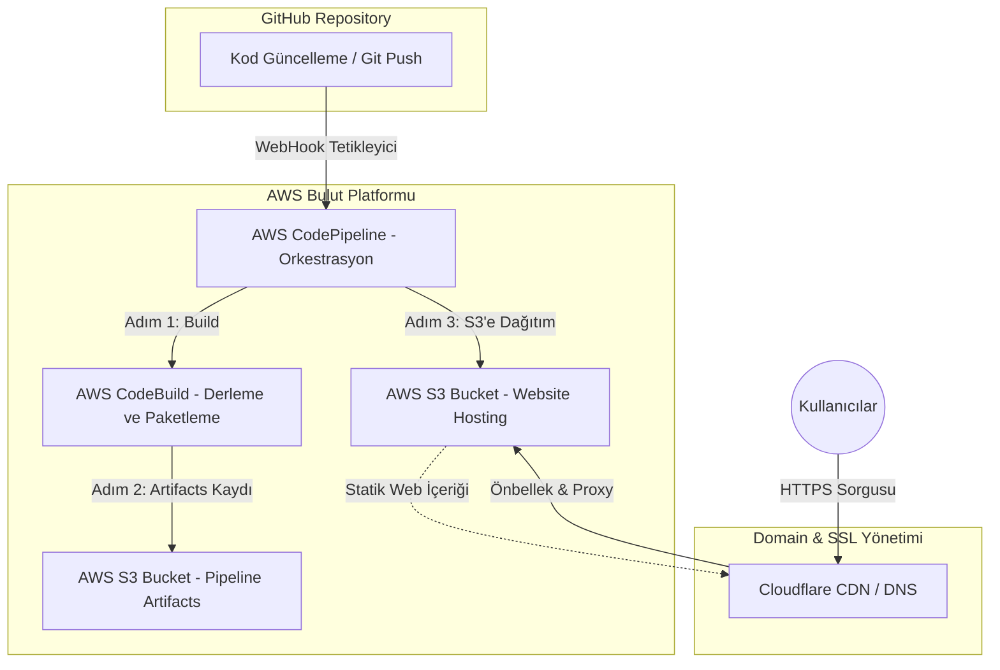

# Dijital Mecra | AWS S3 Hosting & Tam Otomatik CI/CD İş Akışı Rehberi 🚀


Bu proje, bir React uygulamasının **AWS S3** üzerinde statik olarak barındırılmasını ve **AWS CodePipeline** araçları ile uçtan uca otomatik bir **CI/CD (Sürekli Entegrasyon / Sürekli Dağıtım)** hattının nasıl kurulacağını profesyonel düzeyde anlatmaktadır.

Bu rehber, [julien-muke/aws-codepipeline-react-s3](https://github.com/julien-muke/aws-codepipeline-react-s3) eğitim serisi temel alınarak **Dijital Mecra** altyapısına uygun şekilde hazırlanmıştır.

---

## 🏗️ Proje Mimarisi

Daha önce çizmiş olduğumuz bu mimari şema, kodun GitHub'dan başlayıp global CDN ağına (Cloudflare) ulaşana kadar takip ettiği yolu göstermektedir:



---

## 🛠️ Detaylı AWS Kurulum ve Yapılandırma Adımları

Aşağıdaki adımlar, projenizi AWS bulutunda profesyonelce barındırmak için izlemeniz gereken tam prosedürdür.

### Adım 1: GitHub Deposunun Hazırlanması
1. Projenizi GitHub üzerinde yeni bir depoya (repository) pushlayın.
2. Kök dizinde `buildspec.yml` dosyasının bulunduğundan emin olun.
3. **

### Adım 2: Amazon S3 Bucket Kurulumu (Statik Hosting)
1. **Amazon S3** konsoluna gidin ve **"Create bucket"** butonuna tıklayın.
2. **Bucket Name:** `digitalmecra-s3-bucket`
3. **Permissions:** "Block all public access" seçimini kaldırın.
4. **Properties:** En altta **Static website hosting** -> **Enable**.
   - **Index document:** `index.html`
   - **Error document:** `error.html`
5. **

### Adım 3: AWS CodeBuild Projesinin Yapılandırılması
1. **CodeBuild** konsolunda yeni proje oluşturun.
2. **Environment:** Ubuntu, Standard Runtime, Node.js 18+.
3. **Buildspec:** "Use a buildspec file" seçin.
4. **

### Adım 4: AWS CodePipeline CI/CD Hattının Oluşturulması
1. **Step 1: Choose pipeline settings**
   - **Pipeline name:** `digitalmecra-pipeline`
   - **Service role:** "New service role" seçeneğini işaretleyin. Bu, AWS'in gerekli izinleri otomatik oluşturmasını sağlar.
   - **Execution mode:** "Queued" veya "Superseded" seçebilirsiniz.
2. **Step 2: Add source stage**
   - Source provider: **GitHub (Version 2)**.
3. **Step 3: Add build stage**
   - Build provider: **AWS CodeBuild**.
4. **Step 4: Add deploy stage**
   - Deploy provider: **Amazon S3**.
   - **Bucket:** `digitalmecra-s3-bucket`.
   - **ÖNEMLİ:** "Extract file before deploy" kutucuğunu işaretlemeyi unutmayın!
5. **

---

## 🌐 Cloudflare ile Custom Domain & SSL (HTTPS) Ayarları

Sitenizin `digitalmecra.devopsatolyesi.com` üzerinden yayınlanması için:

1. **CNAME Kaydı:** 
   - **Name:** `digitalmecra`
   - **Target:** S3 endpoint (Örn: `digitalmecra-s3-bucket.s3-website-us-east-1.amazonaws.com`)
2. **SSL/TLS:** Ayarı **Full** yapın.
3. **

---

## 🚀 Yerel Geliştirme Notları

```bash
# Bağımlılıkları yükleyin
npm install --legacy-peer-deps

# Geliştirme sunucusunu başlatın
npm run dev
```

**Dijital Mecra** - AWS DevOps Eğitim Serisi