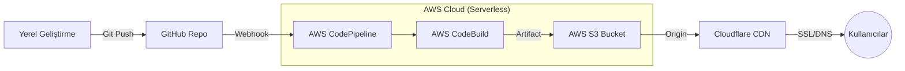

# 🚀 Dijital Mecra | Profesyonel AWS S3 & CodePipeline Dağıtım Rehberi

Bu rehber, **Dijital Mecra** projenizi AWS bulut altyapısı üzerinde nasıl profesyonelce yayına alacağınızı adım adım göstermektedir.

---

## 💡 Neden AWS S3 ve Serverless Hosting?

Geleneksel sunucu (VPS/Dedicated) yönetimi yerine S3 tabanlı statik hosting tercih etmenin temel avantajları şunlardır:
- **Sıfır Sunucu Yönetimi**: OS güncellemeleri, güvenlik yamaları veya sunucu bakımıyla uğraşmazsınız.
- **Maliyet Verimliliği**: Sadece kullandığınız trafik kadar ödeme yaparsınız, boşta duran bir sunucu için ücret ödemezsiniz.
- **Yüksek Performans ve Ölçeklenebilirlik**: S3, Amazon'un global altyapısı üzerinden çalıştığı için trafik aniden artsa bile saniyeler içinde ölçeklenir.
- **Güvenlik**: Sunucu erişimi (SSH) olmadığı için saldırı yüzeyi minimumdur. Cloudflare ile birleştiğinde DDoS koruması ve SSL standart olarak gelir.

---

## 🏗️ Proje Mimarisi (Architecture)

Aşağıdaki şema, kodun yerel geliştirme ortamınızdan global yayına nasıl ulaştığını göstermektedir:

1. **Source**: Kod GitHub deposuna yüklendiğinde CodePipeline tetiklenir.
2. **Build**: AWS CodeBuild, `npm run build` komutunu çalıştırarak statik dosyaları üretir.
3. **Deploy**: Üretilen dosyalar otomatik olarak S3 Bucket'ına aktarılır.
4. **CDN**: Cloudflare, S3 üzerindeki içeriği global sunucularına dağıtır ve SSL sağlar.

---

## 🛠️ Kurulum Adımları (12 Adım)

### Adım 1: S3 Bucket Oluşturma
AWS S3 konsoluna gidin, `s3-digital-mecra` adında bir bucket oluşturun. Bölge: `us-east-1`.

### Adım 2: CodePipeline Başlangıç
Pipeline ismi: `digital-mecra`. Mod: `Queued`. Otomatik rol oluşturulmasına izin verin.

### Adım 3: Kaynak (GitHub) Bağlantısı
`GitHub (via OAuth app)` seçin ve hesabınızı yetkilendirerek bağlantıyı kurun.

### Adım 4: Depo Seçimi
Depo: `hakanbayraktar/s3-landing-page`, Dal: `main`.

### Adım 5: CodeBuild Ortamı
İşletim sistemi: `Amazon Linux 2`. Image: `aws/codebuild/amazonlinux2-x86_64-standard:5.0`.

### Adım 6: Buildspec ve Loglar
Projeye dahil edilen `buildspec.yml` talimatlarını kullanın ve logları aktif edin.

### Adım 7: Build Stage Review
Oluşturduğunuz build projesini seçerek aşamayı onaylayın.

### Adım 8: S3 Dağıtım ve Kritik Ayar
**KRİTİK**: **Extract file before deploy** kutucuğunu işaretlemeyi unutmayın!

### Adım 9: Pipeline İzleme
Tüm aşamaların yeşil (Succeeded) olduğunu doğrulayın.

### Adım 10: Statik Hosting Aktifleştirme
S3 Properties sekmesinden statik hosting'i açın ve `index.html` dosyasını belirtin.

### Adım 11: İzinler ve Bucket Politikası
"Block all public access" ayarını kapatın ve genel erişim için Bucket Policy (JSON) ekleyin.

### Adım 12: Cloudflare CNAME DNS
Cloudflare üzerinden CNAME kaydı oluşturun ve S3 endpoint'inizi hedef gösterin.

---

**Dijital Mecra** - Modern Web ve DevOps Çözümleri 🌟
