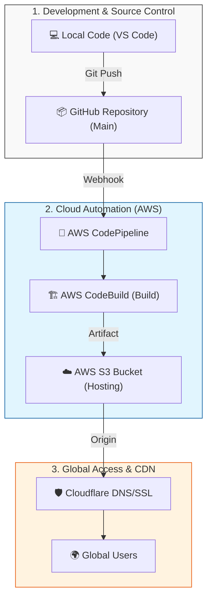

# 🚀 Dijital Mecra | Modern Frontend Landing Page

[](https://aws.amazon.com/)
[](https://www.cloudflare.com/)

This repository contains the source code for the **Dijital Mecra** landing page, a high-performance web application optimized for modern cloud deployment.

---

## 💡 Why Choose AWS S3 & Serverless Hosting?
Key advantages of choosing S3-based static hosting over traditional server management:
- **Zero Server Management**: No OS updates, no security patches. AWS handles the infrastructure.
- **Cost Efficiency**: You only pay for what you use. Virtually free for small to medium sites.
- **Global Scalability**: S3 integrates with CDNs like Cloudflare for millisecond loading times.
- **Top-Tier Security**: No server access (no SSH) means a drastically reduced attack surface.

---

## 🏗️ Architecture: How It Works
The following vertical diagram illustrates the journey from local development to global users:


1. **Source**: Code pushed to GitHub triggers the pipeline.
2. **Build**: CodeBuild runs `npm run build` to generate the production assets.
3. **Deploy**: Files are automatically synced to the S3 Bucket.
4. **CDN**: Cloudflare caches S3 content globally and provide SSL support.

---

## 🚀 Setup & Deployment Guide

For a comprehensive, step-by-step walkthrough with visual guides, please refer to my detailed article on Medium:

👉 **[Deploying Modern Frontend Applications with AWS S3, CodePipeline, and Cloudflare](https://hbayraktar.medium.com/deploying-modern-frontend-applications-with-aws-s3-codepipeline-and-cloudflare-6d05d7268051?postPublishedType=repub)**

This article covers:
- S3 Bucket & Static Hosting configuration.
- AWS CodePipeline & CodeBuild setup (CI/CD).
- SSL & Custom Domain setup with Cloudflare.
- Security best practices (Bucket Policies & CORS).

---

## 💻 Local Development

```bash
# Install dependencies
npm install --legacy-peer-deps

# Start development server
npm run dev

# Build for production
npm run build
```
