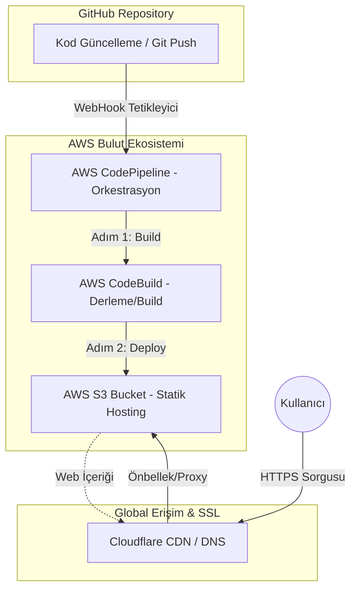

# Dijital Mecra | AWS S3 Hosting & Otomatik CI/CD Dağıtım Rehberi 🚀


Bu proje, modern bir React uygulamasının **AWS S3** üzerinde statik olarak barındırılmasını ve **AWS DevOps** araçları ile tam otomatik bir yayınlama (deployment) hattının nasıl kurulacağını adım adım öğretir.

---

## 🏗️ Proje Mimarisi

Aşağıdaki diyagram, kodun GitHub'a gönderilmesinden son kullanıcıya ulaşmasına kadar geçen otomatik süreci göstermektedir:



---

## ☁️ AWS S3 Statik Hosting Kurulumu

1. **Bucket Oluşturma**:
   - AWS S3 paneline gidin.
   - Bucket ismi olarak domain adınızı (veya projenizi) girin.
   - *Buraya S3 Bucket oluşturma ekran görüntüsü lazım.*

2. **Statik Web Hosting'i Etkinleştirme**:
   - **Properties** sekmesine gidin.
   - En alttaki **Static website hosting** kısmını düzenleyin.
   - **Index document:** `index.html`
   - **Error document:** `error.html` olarak kaydedin.

---

## ⚙️ CI/CD Pipeline (Otomatik Yayınlama) Yapılandırması

Modern yazılım geliştirme süreçlerinde manuel dosya yükleme devri bitti! Bu projede her `git push` sonrası otomatik build alınıp S3'e yüklenmektedir.

1. **CodePipeline Başlatma**:
   - AWS CodePipeline servisine gidin.
   - Kaynak (Source) olarak GitHub'ı seçin ve repo bağlantısını yapın.

2. **CodeBuild Ayarları**:
   - `buildspec.yml` projenin kök dizininde olduğu için AWS bunu otomatik tanıyacaktır.
   - Bu dosya içinde `npm install --legacy-peer-deps` ve `npm run build` komutları çalıştırılır.
   - *Buraya CodeBuild yapılandırma ekran görüntüsü lazım.*

3. **S3 Dağıtım Adımı**:
   - Pipeline "Deploy" adımında az önce oluşturduğunuz S3 bucket'ı seçin.
   - **ÖNEMLİ:** "Extract file before deploy" seçeneğini işaretleyerek dosyaların zip yerine ham haliyle S3'e atılmasını sağlayın.

---

## 🌐 Cloudflare & Özel Domain Bağlantısı

Sitenizin `s3-website.abc.amazonaws.com` yerine `www.siteniz.com` gibi görünmesi ve ücretsiz SSL (https) sahibi olması için:

1. **DNS Kaydı**:
   - Cloudflare panelinde bir **CNAME** kaydı oluşturun.
   - **İsim (Name):** `www`
   - **Hedef (Target):** S3 bucket'ınızın statik hosting endpoint'ini yapıştırın.
   - *Buraya Cloudflare CNAME kayıt ekranı görseli lazım.*

2. **SSL/TLS Modu**:
   - SSL ayarını **Full** veya **Full (Strict)** yapın.

3. **Önbellek & Performans**:
   - Cloudflare üzerinden mini-fication ve CDN özelliklerini aktif ederek hızı optimize edin.

---

## 🚀 Yerel Geliştirme

Projeyi yerelinizde test etmek için:

```bash
# Bağımlılıkları kurun (Vite 6 ve React 18 uyumlu)
npm install --legacy-peer-deps

# Geliştirme sunucusunu başlatın
npm run dev
```

---

## 🗑️ Kaynak Yönetimi
Çalışmanız bittiğinde, AWS üzerinde ücret ödememek için Pipeline ve S3 Bucket'ı silebilirsiniz. 

**Dijital Mecra** ile bulut teknolojilerine ilk adımınızı attığınız için tebrikler!