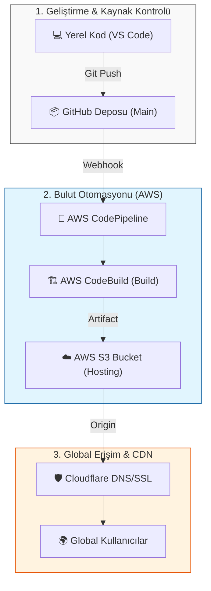

# 🚀 Dijital Mecra | Profesyonel AWS S3 & CodePipeline Dağıtım Rehberi

Bu rehber, **Dijital Mecra** projenizi AWS bulut altyapısı üzerinde nasıl profesyonelce yayına alacağınızı adım adım göstermektedir.

---

## 💡 Neden AWS S3 ve Serverless Hosting?
Geleneksel sunucu yönetimi yerine S3 tabanlı statik hosting tercih etmenin avantajları:
- **Sıfır Sunucu Yönetimi**: OS güncellemeleri veya bakımla uğraşmazsınız.
- **Maliyet Verimliliği**: Sadece kullandığınız trafik kadar ödeme yaparsınız.
- **Yüksek Performans**: Amazon'un global altyapısı ile anında ölçeklenme.
- **Güvenlik**: Sunucu erişimi (SSH) olmadığı için saldırı yüzeyi minimumdur.

---

## 🏗️ Proje Mimarisi (Architecture)
Aşağıdaki dikey şema, kodun yerel geliştirme ortamınızdan globale ulaşma yolculuğunu göstermektedir:

1. **Source**: Kod GitHub'a yüklendiğinde Pipeline tetiklenir.
2. **Build**: CodeBuild `npm run build` ile statik dosyaları üretir.
3. **Deploy**: Dosyalar otomatik olarak S3 Bucket'ına aktarılır.
4. **CDN**: Cloudflare global dağıtım ve SSL sağlar.

---

## 🛠️ Kurulum Adımları (12 Adım)

**Adım 1: S3 Bucket Oluşturma**
AWS S3 konsoluna gidin, `s3-digital-mecra` adında bir bucket oluşturun. Bölge: `us-east-1` (Vegas).

**Adım 2: CodePipeline Başlangıç**
Pipeline ismi: `digital-mecra`. Mod: `Queued`. Otomatik rol oluşturulmasına izin verin.

**Adım 3: Kaynak (GitHub) Bağlantısı**
`GitHub (via OAuth app)` seçin ve hesabınızı yetkilendirerek bağlantıyı kurun.

**Adım 4: Depo Seçimi**
Depo: `hakanbayraktar/s3-landing-page`, Dal: `main`.

**Adım 5: CodeBuild Ortamı**
İşletim sistemi: `Amazon Linux 2`. Image: `aws/codebuild/amazonlinux2-x86_64-standard:5.0`.

**Adım 6: Buildspec ve Loglar**
Projeye dahil edilen `buildspec.yml` talimatlarını kullanın ve logları aktif edin.

**Adım 7: Build Stage Review**
Oluşturduğunuz build projesini seçerek aşamayı onaylayın.

**Adım 8: S3 Dağıtım ve Kritik Ayar**
**KRİTİK**: **Extract file before deploy** kutucuğunu işaretlemeyi unutmayın!

**Adım 9: Pipeline İzleme**
Tüm aşamaların yeşil (Succeeded) olduğunu doğrulayın.

**Adım 10: Statik Hosting Aktifleştirme**
S3 Properties sekmesinden statik hosting'i açın ve `index.html` dosyasını belirtin.

**Adım 11: İzinler ve Bucket Politikası**
"Block all public access" ayarını kapatın ve genel erişim için Bucket Policy (JSON) ekleyin.

**Adım 12: Cloudflare CNAME DNS**
Cloudflare üzerinden CNAME kaydı oluşturun ve S3 endpoint'inizi hedef gösterin.

---

**Dijital Mecra** - Modern Web ve DevOps Çözümleri 🌟
