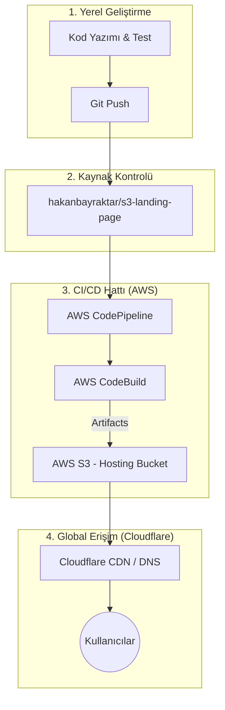

# 🚀 Dijital Mecra | AWS S3 & Cloudflare Dağıtım Rehberi

[](https://aws.amazon.com/)
[](https://www.cloudflare.com/)
[](https://en.wikipedia.org/wiki/DevOps)

Modern web uygulamalarınızı **AWS S3** üzerinde barındırıp, **AWS CodePipeline** ve **Cloudflare** ile profesyonel bir yayına alma sürecini bu rehberde bulabilirsiniz.

---

## 🏗️ Mimari Yapı

Aşağıdaki şemada, kodun yerel makinenizden başlayıp global olarak nasıl yayına girdiği gösterilmektedir:



---

## 🛠️ Adım 1: S3 Bucket & Statik Hosting

İlk aşamada dosyalarımızın barınacağı ana alanı oluşturuyoruz.

> [!IMPORTANT]
> **Bucket İsmi Hakkında**: Yaygın bir yanlış inanışın aksine, Cloudflare ile CNAME kullanırken S3 bucket ismi mutlaka domain adınızla aynı olmak zorunda değildir. Ancak düzenli olması adına benzer bir isim seçmeniz önerilir.

1.  **Bucket Oluşturma**: `s3-digital-mecra` isminde bir bucket oluşturun.
2.  **Statik Web Sitesi**: "Static website hosting" özelliğini aktif edin.


---

## 🔄 Adım 2: AWS CodePipeline CI/CD Kurulumu

Kodunuz her değiştiğinde sitenizin otomatik güncellenmesi için bir boru hattı (pipeline) kuruyoruz.

1.  **Pipeline Ayarları**: Queued (Kuyruğa alınmış) modda ve yeni bir `Service Role` ile başlatın.
2.  **Kaynak**: GitHub (OAuth) kullanarak deponuzu bağlayın.
3.  **Build**: AWS CodeBuild kullanarak `npm run build` komutunu çalıştıracak yapılandırmayı yapın.
4.  **Deploy**: Oluşturulan dosyaları seçtiğiniz S3 bucket'ına dağıtın.

| Pipeline Ayarları | Kaynak Aşaması |
| :--- | :--- |
|  |  |

---

## 🌐 Adım 3: Cloudflare & Custom Domain Bağlantısı

Sitenizi profesyonel bir domain üzerinden (`digitalmecra.devopsatolyesi.com`) yayına almak için Cloudflare ayarlarını yapıyoruz.

1.  **CNAME Kaydı**: Cloudflare DNS panelinden bir `CNAME` kaydı açın.
2.  **Hedef (Target)**: Hedef olarak S3 **Static Web Site Endpoint** adresini girin (Örn: `s3-digital-mecra.s3-website-us-east-1.amazonaws.com`).
3.  **Proxy Status**: "Proxied" (Turuncu Bulut) durumuna getirin.


---

## 🚨 Kritik Yapılandırmalar: CORS ve İzinler

Sitenizin sorunsuz çalışması (özellikle asset'lerin yüklenmesi) için aşağıdaki iki ayar hayati önem taşır.

### 1️⃣ CORS Ayarı (Cross-Origin Resource Sharing)
Farklı kökenlerden gelen isteklerin (Cloudflare -> S3) reddedilmemesi için S3 Bucket -> Permissions -> CORS kısmına şu JSON'u ekleyin:

```json
[
    {
        "AllowedHeaders": ["*"],
        "AllowedMethods": ["GET", "HEAD"],
        "AllowedOrigins": ["*"],
        "ExposedHeaders": []
    }
]
```

### 2️⃣ Bucket Policy (İzinler)
Dosyaların dünya genelinden okunabilmesi (403 Forbidden hatası almamak için):

```json
{
    "Version": "2012-10-17",
    "Statement": [
        {
            "Sid": "PublicReadGetObject",
            "Effect": "Allow",
            "Principal": "*",
            "Action": "s3:GetObject",
            "Resource": "arn:aws:s3:::s3-digital-mecra/*"
        }
    ]
}
```

---

## 🚀 Yerel Geliştirme

Projeyi yerelde çalıştırmak için:

```bash
# Bağımlılıkları yükleyin
npm install --legacy-peer-deps

# Geliştirme sunucusunu başlatın
npm run dev
```

**Dijital Mecra** - Modern Web ve DevOps Çözümleri 🌟