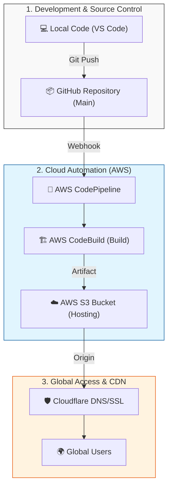

# 🚀 Dijital Mecra | Professional AWS S3 & CodePipeline Deployment Guide

This guide walk you through the exact process of deploying your **Dijital Mecra** project professionally on AWS cloud infrastructure.

---

## 💡 Why Choose AWS S3 & Serverless Hosting?
Key advantages of choosing S3-based static hosting over traditional server management:
- **Zero Server Management**: No OS updates, no security patches. AWS handles the infrastructure.
- **Cost Efficiency**: You only pay for what you use. Virtually free for small sites.
- **Global Scalability**: S3 integrates with CDNs like Cloudflare for millisecond loading.
- **Top-Tier Security**: No server access means a drastically reduced attack surface.

---

## 🏗️ Architecture: How It Works
The following vertical diagram illustrates the journey from your keyboard to the user's browser:

1. **Source**: Code pushed to GitHub triggers the pipeline.
2. **Build**: CodeBuild runs `npm run build` to generate the `dist` folder.
3. **Deploy**: Files are automatically synced to S3.
4. **CDN**: Cloudflare caches S3 content globally and provide SSL support.

---

## 🛠️ Setup Steps (12 Steps)

**Step 1: Create Your S3 Bucket**
Head to the S3 console, create a bucket (e.g., `s3-digital-mecra`). Region: `us-east-1` (Vegas).

**Step 2: Initialize CodePipeline**
Create a new pipeline. Name: `digital-mecra`. Mode: `Queued`. Allow a new service role.

**Step 3: Connect to GitHub**
Select `GitHub (via OAuth app)` as source. Authorize to allow listening for commits.

**Step 4: Repository and Branch Selection**
Select your repo (`hakanbayraktar/s3-landing-page`) and the `main` branch.

**Step 5: Configure CodeBuild Environment**
OS: `Amazon Linux 2`. Image: `aws/codebuild/amazonlinux2-x86_64-standard:5.0`.

**Step 6: Buildspec and Logging**
Use the `buildspec.yml` in your root. Enable `CloudWatch logs` for build debugging.

**Step 7: Finalize Build Stage**
Confirm your CodeBuild project and proceed to deployment.

**Step 8: Deploy to S3 (Crucial Step)**
**CRITICAL**: Check the **"Extract file before deploy"** box to serve individual files.

**Step 9: Monitor Your First Deployment**
Wait for all three stages (Source, Build, Deploy) to show the green **"Succeeded"** status.

**Step 10: Enable Static Website Hosting**
In S3 Properties, enable **Static website hosting** and specify `index.html` as the index.

**Step 11: Permissions and Public Access**
Disable "Block all public access" and apply a **Bucket Policy** JSON for global read access.

**Step 12: DNS Configuration with Cloudflare**
Add a `CNAME` in Cloudflare pointing to the S3 Website Endpoint. Set to **Proxied**.

---
